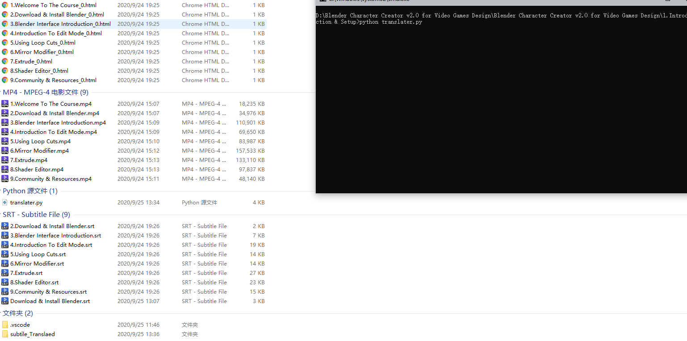
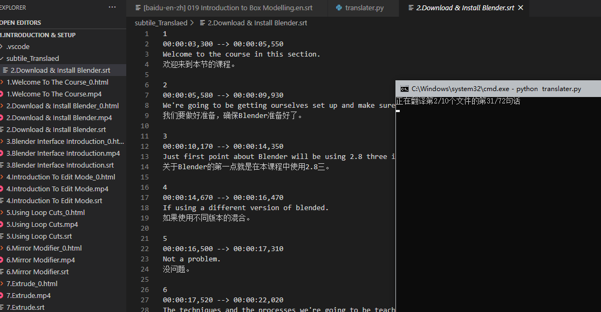

# 使用方法 
一个调用百度API的字幕翻译小脚本 
环境：win10 x64 ; python 3.8.5 
保证translater.py和字幕文件在同一个文件夹内，脚本会自动侦测所有srt格式的文件，翻译完成后会自动在当前目录下新建文件夹subtitle_translaed，结果储存在这个文件夹里面，文件名与源字幕名相同。打开命令行，进入脚本所在文件，输入python translater.py，如图 
 
运行结果如图 
 
注意两个地方：APIID secretKey，这些可以从百度翻译开放平台自己获取。 
使用愉快 
